# Audit workspace Manager — Strategic Copilot (frontend)

**Date :** 2026-05-25  
**Périmètre :** rôle `manager` · routes `/workspace/manager/*`  
**Codebase :** `copilot-ui/src`  
**Backend :** webhooks n8n (`https://n8nprod.aphelionxinnovations.com`) — en dev, proxy Vite `/webhook` → n8n  
**Auth :** `Authorization: Bearer <JWT>` sur tous les appels (via `httpClient`, `api/api.ts`, Axios dédiés)

---

## 1. Vue d’ensemble

| Élément | Détail |
|---------|--------|
| **Layout** | `layouts/manager-workspace-layout.tsx` → `WorkspaceShellLayout` |
| **Navigation** | `layouts/nav/manager-workspace-nav.ts` — **9 entrées** sidebar |
| **Protection** | `ProtectedRoute` rôles `manager` \| `rh` (`main.tsx`) |
| **Stack data** | React Query + hooks dédiés + Axios / `fetch` |
| **Topbar** | `components/app/manager-notifications-topbar.tsx` — cloche notifications |
| **Copilot global** | `<CopilotPanel />` monté à la racine (`main.tsx`) |
| **Copilot page** | `useCopilotPage(...)` sur certaines pages (contexte IA) |

### Routes actives (`main.tsx`)

| Route | Page | Menu latéral | Statut |
|-------|------|--------------|--------|
| `/workspace/manager` | Redirect → `dashboard` | — | Actif |
| `/workspace/manager/dashboard` | `DashboardPage` | Oui | Actif |
| `/workspace/manager/projects` | `ProjectsPage` | Oui | Actif |
| `/workspace/manager/projects/:projectId` | Redirect → `projects?openProjectId=` | Non | Legacy redirect |
| `/workspace/manager/team` | `TeamPage` | Oui | Actif |
| `/workspace/manager/team/:talentId` | `TalentDetailPage` | Non (sous-page) | Actif |
| `/workspace/manager/talent-requests` | `TalentRequestsPage` | Oui | Actif |
| `/workspace/manager/rh-requests` | `ManagerRhRequestsPage` | Oui | Actif |
| `/workspace/manager/risks` | `RisksPage` | Oui | Actif |
| `/workspace/manager/decision-log` | `DecisionLogPage` | Oui | Actif |
| `/workspace/manager/reports` | `ReportsPage` | Oui | Actif |
| `/workspace/manager/profile` | `ProfilePage` | Oui | Actif |
| `/workspace/manager/notifications` | `NotificationsPage` | **Non** (topbar) | Actif |
| `/workspace/manager/helper` | `HelperChatPage` | **Non** | Actif |

### Redirects / legacy

| Route | Redirection |
|-------|-------------|
| `project` | → `projects` |
| `recommendations` | → `dashboard` |
| `what-if`, `portfolio` | → `projects` |
| `monitoring` | → `team` |

### Sidebar (`manager-workspace-nav.ts`)

| Label UI | Clé i18n | Path |
|----------|----------|------|
| Tableau de bord | `nav:managerNavDashboard` | `/workspace/manager/dashboard` |
| Mes projets | `nav:managerNavProjects` | `/workspace/manager/projects` |
| Équipe | `nav:managerNavTeam` | `/workspace/manager/team` |
| Demandes talents | `nav:managerNavTalentRequests` | `/workspace/manager/talent-requests` |
| Demandes RH | `nav:managerNavRhRequests` | `/workspace/manager/rh-requests` |
| Risques | `nav:managerNavRisks` | `/workspace/manager/risks` |
| Journal décisions | `nav:decisionLog` | `/workspace/manager/decision-log` |
| Rapports | `nav:managerNavReports` | `/workspace/manager/reports` |
| Profil | `nav:profile` | `/workspace/manager/profile` |

---

## 2. Infrastructure API commune

### Proxy Vite (dev)

| Préfixe client | Cible n8n |
|----------------|-----------|
| `/webhook/*` | `VITE_N8N_PROXY_TARGET/webhook/*` |
| `/n8n-webhook/*` | idem (tâches projet WMT) |
| `/api/*` | `…/webhook/api/*` (rewrite) |

Fichiers : `vite.config.ts` (racine monorepo), `copilot-ui/vite.config.ts`.

### Clients HTTP

| Fichier | Rôle |
|---------|------|
| `lib/http-client.ts` | Axios principal — refresh 401, intercepteurs |
| `api/api.ts` | `httpGet/Post/Patch/Delete` — Bearer auto, refresh |
| `services/projectTasksApi.ts` | Axios dédié tâches — base `/n8n-webhook` en dev |
| `lib/build-n8n-url.ts` | Construction URLs n8n absolues / relatives |

### Variables d’environnement manager (principales)

| Variable | Usage |
|----------|--------|
| `VITE_N8N_PROXY_TARGET` | Cible proxy dev (défaut n8n prod) |
| `VITE_API_BASE_URL` | Override base projets manager |
| `VITE_MANAGER_PROJECTS_DETAIL_URL` | GET détail projet WMP |
| `VITE_MANAGER_PROJECTS_UPDATE_URL` | PATCH projet WMP |
| `VITE_WMP_DETAIL_PROJECTS_PREFIX` | Préfixe workflow détail |
| `VITE_WMP_UPDATE_PROJECTS_PREFIX` | Préfixe workflow update |
| `VITE_WMP_ASSIGN_PROJECTS_PREFIX` | POST assignation talent |
| `VITE_WMP_UNASSIGN_PROJECTS_PREFIX` | DELETE désassignation |
| `VITE_WMP_TASKS_PROJECTS_PREFIX` | Base tâches (legacy config) |
| `VITE_MANAGER_TEAM_DETAIL_URL` | GET détail talent WMT |
| `VITE_MANAGER_ANALYST_IPI_URL` | POST analyste IPI |
| `VITE_MANAGER_ANALYST_NINE_BOX_URL` | POST nine-box |
| `VITE_MANAGER_ANALYST_MOBILITY_URL` | POST mobilité |
| `VITE_MANAGER_PROJECT_TALENTS_URL` | POST matchmaker |
| `VITE_RH_ACTIONS_URL` | GET/POST actions RH (`/api/rh/actions`) |
| `VITE_RH_ACTIONS_PATCH_URL` | PATCH action RH (UUID workflow n8n) |
| `VITE_API_ME` | GET/PATCH profil auth |
| `VITE_API_CHANGE_PASSWORD` | PATCH mot de passe |
| `VITE_SUPABASE_URL` / `VITE_SUPABASE_ANON_KEY` | Upload avatar profil |
| `VITE_MANAGER_ENTERPRISE_ID` | Fallback `enterprise_id` (decision-log) |
| `VITE_TRIGGER_PROJECT_RECOMPUTE_AFTER_ASSIGN` | Recompute auto après assign |

---

## 3. Cartographie API complète

### 3.1 `api/manager-dashboard.api.ts`

| Méthode | Endpoint | Fonction |
|---------|----------|----------|
| GET | `/webhook/manager/dashboard?scope=mine\|enterprise` | `managerDashboardApi.get` |

**Consommé par :** dashboard, risks (agrégé), notifications (fallback), reports (partiel).

---

### 3.2 `api/manager-projects.api.ts`

| Méthode | Endpoint | Fonction |
|---------|----------|----------|
| GET | `/webhook/manager/projects` | `list` |
| POST | `/webhook/manager/projects` | `create` |
| GET | `/webhook/wmp-detail-v1/manager/projects/:id` | `getDetail` |
| PATCH | `/webhook/wmp-update-v1/manager/projects/:id` | `update` |
| POST | `/webhook/wmp-assign-v1/manager/projects/:id/assignments` | `assignTalent` |
| DELETE | `/webhook/wmp-unassign-v1/manager/projects/:id/assignments/:talentId` | `unassignTalent` |

**Config :** `config/manager-projects-api.config.ts`, `config/wmp-assignments-webhook.config.ts`.

---

### 3.3 `api/manager-team.api.ts`

| Méthode | Endpoint | Fonction |
|---------|----------|----------|
| GET | `/webhook/manager/team` | `list` |
| GET | `/webhook/wmt-detail-v1/manager/team/:talentId` | `getTalentDetail` |
| POST | `/webhook/api/watchdog/scan` | `watchdogScan` |

**Config :** `config/manager-team-api.config.ts` (`VITE_MANAGER_TEAM_DETAIL_URL`).

---

### 3.4 `api/manager-notifications.api.ts`

| Méthode | Endpoint | Fonction |
|---------|----------|----------|
| GET | `/webhook/wmn-list-notif-v3/manager/notifications` | `notifications` (v3) |
| GET | `/webhook/manager/notifications` | fallback v1 |
| PATCH | `/webhook/wmn-ack-v3/manager/notifications/:id/ack` | `ackNotification` |
| PATCH | `/webhook/manager/notifications/:id/ack` | fallback ack |
| GET | `/webhook/manager/copilot-decisions` | `decisions` |
| GET | `/webhook/manager/rh-actions` | `rhActions` (legacy) |
| PATCH | `/webhook/manager/rh-actions/:id` | `patchRhAction` (legacy) |

---

### 3.5 `api/manager-risk-alerts.api.ts`

| Méthode | Endpoint | Fonction |
|---------|----------|----------|
| PATCH | `/webhook/wmn-alert-v3/manager/risk-alerts/:id` | `patchManagerRiskAlert` |

Body typique : `{ action: 'ack' \| 'resolve' \| 'snooze', ... }`.

---

### 3.6 `api/manager-analyst.api.ts`

| Méthode | Endpoint | Fonction |
|---------|----------|----------|
| POST | `/webhook/api/analyst/ipi` | `getManagerAnalystIPI` |
| POST | `/webhook/api/analyst/nine-box` | `getManagerAnalystNineBox` |
| POST | `/webhook/api/analyst/mobility` | `getManagerAnalystMobility` |

**Hook :** `use-manager-analyst.ts` → `AnalystSection` (dashboard).

---

### 3.7 `api/manager-matchmaker.api.ts`

| Méthode | Endpoint | Fonction |
|---------|----------|----------|
| POST | `/webhook/api/project/talents` | `runProjectTalentMatching` |

**Hook :** `use-manager-matchmaker.ts` → `MatchmakerSection` (dashboard).

---

### 3.8 `api/rh-actions.api.ts` *(stack principale demandes RH)*

| Méthode | Endpoint | Fonction |
|---------|----------|----------|
| GET | `/webhook/api/rh/actions` | `fetchRhActionsList` |
| POST | `/webhook/api/rh/actions` | `postRhAction` |
| PATCH | `/webhook/c8bae94d-…/api/rh/actions/:id` | `patchRhAction` |

**Hooks :** `use-rh-actions-query.ts` → page `rh-requests`.

---

### 3.9 `api/project-risks.api.ts`

| Méthode | Endpoint | Fonction |
|---------|----------|----------|
| GET | `/webhook/api/project/risks` | `getProjectRisks` |
| GET | `/webhook/api/project/risks?project_id=:id` | filtre projet |

---

### 3.10 `api/orchestrator.api.ts`

| Méthode | Endpoint | Fonction |
|---------|----------|----------|
| POST | `/webhook/api/project/viability` | `computeViability` |
| POST | `/webhook/api/project/what-if` | `whatIf` |
| POST | `/webhook/api/copilot/recompute` | `recomputeFull` |

**Hooks :** `useWhatIf`, `use-project-viability-refresh`, Mission Control modal.

---

### 3.11 `api/strategist.api.ts`

| Méthode | Endpoint | Fonction |
|---------|----------|----------|
| POST | `/webhook/api/strategist/propose` | `propose` |
| POST | `/webhook/api/strategist/execute` | `execute` |

**Hooks :** `useStrategistOptions`, `use-project-strategist-arbitrage`.

---

### 3.12 `api/agents.api.ts`

| Méthode | Endpoint | Fonction |
|---------|----------|----------|
| POST | `/webhook/api/project/details` | détails agent |
| POST | `/webhook/api/project/risks` | risques agent |
| POST | `/webhook/api/project/talents` | talents agent |

---

### 3.13 `api/helper.api.ts`

| Méthode | Endpoint | Fonction |
|---------|----------|----------|
| POST | `/webhook/api/helper/chat` | `helperApi.chat` |
| POST | `/webhook/api/helper/validations` | validations helper |

En dev : chemin relatif `/api/helper/chat` (proxy).

---

### 3.14 `api/reports.api.ts`

| Méthode | Endpoint | Fonction |
|---------|----------|----------|
| GET | `/webhook/reports/history` | `fetchReportsHistory` |
| GET | `/webhook/reports/summary` | `getReportsSummary` |
| GET | `/system/health` | `getSystemHealth` |
| POST | `/webhook/reports/generate-board-pack` | `generateBoardPack` |
| POST | `/webhook/reports/generate-project-dossier` | `generateProjectDossier` |
| POST | `/webhook/reports/delete` | `deleteReport` |
| POST | `/webhook/reports/send-email` | `sendReportEmail` |
| POST | `/webhook/reports/schedule` | `scheduleReport` |

---

### 3.15 `services/decisions.api.ts`

| Méthode | Endpoint | Fonction |
|---------|----------|----------|
| GET | `/webhook/manager/copilot-decisions` | `list` |
| GET | `/webhook/manager/decisions/log` | `getManagerLog` |
| POST | `/webhook/manager/decisions/mark-handled` | `markHandled` |
| POST | `/webhook/manager/decisions/delete` | `deleteDecision` |

---

### 3.16 `services/chat.api.ts` + `api/manager-conversations.api.ts`

| Méthode | Endpoint | Fonction |
|---------|----------|----------|
| GET | `/webhook/manager/conversations` | `getConversations` |
| GET | `/webhook/manager/conversations/:id` | `getConversation` |
| PATCH | `/webhook/manager/conversations/:id/archive` | `archiveConversation` |
| POST | `/webhook/api/helper/chat` | `sendMessage` |

---

### 3.17 `services/projectTasksApi.ts` *(workflows WMT)*

| Méthode | Endpoint | Fonction |
|---------|----------|----------|
| GET | `/webhook/wmt-list-v1/manager/projects/:id/tasks` | `list` |
| POST | `/webhook/wmt-create-v1/manager/projects/:id/tasks` | `create` |
| PATCH | `/webhook/wmt-update-v1/manager/projects/:id/tasks/:taskId` | `update` |
| PATCH | `/webhook/wmt-complete-v1/manager/projects/:id/tasks/:taskId/complete` | `complete` |
| DELETE | `/webhook/wmt-delete-v1/manager/projects/:id/tasks/:taskId` | `remove` |

**Hook :** `use-project-tasks.ts` → Mission Control modal (onglet Tâches).

---

### 3.18 `services/auth.api.ts` *(profil manager)*

| Méthode | Endpoint | Fonction |
|---------|----------|----------|
| GET | `/webhook/auth/me` | `getMe` |
| PATCH | `/webhook/auth/me` | `updateProfile` |
| PATCH | `/webhook/auth/me/password` | `changePassword` |
| POST | `/webhook/auth/logout` | logout |

**Avatar :** upload Supabase (`lib/supabase-avatar-upload.ts`) — hors n8n.

---

## 4. Diagramme flux données

```mermaid
flowchart TB
    subgraph UI["Pages Manager"]
        D[Dashboard]
        P[Projets]
        T[Équipe]
        TD[Fiche talent]
        TR[Talent-requests]
        RR[RH-requests]
        R[Risques]
        DL[Decision-log]
        RP[Rapports]
        N[Notifications]
        H[Helper]
        PR[Profil]
    end

    subgraph API["Webhooks n8n"]
        MD["/manager/dashboard"]
        MP["/manager/projects + wmp-*"]
        MT["/manager/team + wmt-detail"]
        WD["/api/watchdog/scan"]
        MN["wmn-list/ack/alert-v3"]
        RA["/api/rh/actions"]
        MRA["/manager/rh-actions"]
        PRisk["/api/project/risks"]
        ORCH["/api/project/viability|what-if"]
        STRAT["/api/strategist/*"]
        ANAL["/api/analyst/*"]
        MM["/api/project/talents"]
        WMT["wmt-*-v1/tasks"]
        DEC["/manager/decisions/*"]
        REP["/reports/*"]
        CHAT["/manager/conversations + helper/chat"]
        AUTH["/auth/me"]
    end

    D --> MD & ANAL & MM
    P --> MP & ORCH & STRAT & WMT & CHAT
    T --> MT & WD
    TD --> MT & WD & MN
    TR --> MRA
    RR --> RA & MP
    R --> PRisk & MD & MN & WD
    DL --> DEC & MP
    RP --> REP & MD & DEC
    N --> MN & WD
    H --> CHAT & MP
    PR --> AUTH
```



---

## 5. Audit page par page

### 5.1 Tableau de bord — `/workspace/manager/dashboard`

| | |
|---|---|
| **Fichier** | `pages/manager/DashboardPage.tsx` |
| **Composants** | `DashboardHeroCopilot`, `DashboardKpiCard`, `MatchmakerSection`, `AnalystSection`, `NineBoxInteractive`, alertes |
| **Hooks** | `useDashboard("mine")`, `useManagerAnalystDashboard`, `useManagerMatchmaker` |
| **API** | GET dashboard · POST analyst (IPI, nine-box, mobility) · POST matchmaker · liste projets |
| **Maturité** | **Complet** |
| **Bug connu** | Liens vers **`/workspace/manager/hr-requests`** (404) — route correcte : **`rh-requests`** |

---

### 5.2 Mes projets — `/workspace/manager/projects`

| | |
|---|---|
| **Fichier** | `pages/manager/ProjectsPage.tsx` |
| **Composants** | `manager-projects-portfolio-table`, `manager-projects-kanban`, `project-mission-control-modal`, `ManagerProjectCopilotPanel` |
| **Hooks** | `useProjects`, `useProjectDetail`, `useCreateProject`, `useUpdateProject`, `useAssignTalent`, `useUnassignTalent`, `useWhatIf`, `useProjectTasks`, `useDecisions`, `useChat`, viabilité, strategist, recompute |
| **API** | WMP (CRUD, assign) · orchestrator · strategist · WMT tasks · conversations/helper |
| **Ouverture projet** | `?openProjectId=` ou redirect `projects/:projectId` |
| **Maturité** | **Complet** — page la plus riche du workspace |
| **Points d’attention** | Forte dépendance `VITE_*` ; PATCH projet sérialisé par `projectId` |

---

### 5.3 Équipe — `/workspace/manager/team`

| | |
|---|---|
| **Fichier** | `pages/manager/TeamPage.tsx` |
| **Composants** | `components/team/*` — filtres, tableau, `TalentDrawer`, `AllocationBar`, `IpiVisualBadge` |
| **Hooks** | `useTeam`, `useWatchdogScan` |
| **API** | GET `/manager/team` · POST watchdog scan |
| **Filtres URL** | `?filter=overloaded`, `?contract_ending=1`, `?talent_id=` |
| **Maturité** | **Complet** |

---

### 5.4 Fiche talent — `/workspace/manager/team/:talentId`

| | |
|---|---|
| **Fichier** | `pages/manager/TalentDetailPage.tsx` |
| **Composants** | `components/talent/details/*` — Hero, KPI, radar, timeline, nine-box |
| **Hooks** | `useTalentDetail`, `useWatchdogScan`, `useRiskAlertAction` |
| **API** | GET `wmt-detail-v1/manager/team/:uuid` · watchdog · PATCH risk-alerts |
| **Maturité** | **Complet** (UI) |
| **Risque** | **404 n8n** si UUID invalide ou workflow non publié |
| **Onglet** | `?tab=watchdog` déclenche scan auto |

---

### 5.5 Demandes talents — `/workspace/manager/talent-requests`

| | |
|---|---|
| **Fichier** | `pages/manager/TalentRequestsPage.tsx` |
| **Hooks** | `useRhActions` (webhook **legacy**), `usePatchRhAction`, `useTeam` |
| **API** | GET/PATCH `/webhook/manager/rh-actions` |
| **Contenu** | Actions RH filtrées « talent-sourced », accept/reject |
| **Maturité** | **Partiel** — stack **différente** de `rh-requests` |
| **Problème** | Double stack actions RH (voir §7) |

---

### 5.6 Demandes RH — `/workspace/manager/rh-requests`

| | |
|---|---|
| **Fichier** | `pages/workspace/manager/manager-rh-requests-page.tsx` → `components/manager/rh-requests/rh-requests-page.tsx` |
| **Hooks** | `useRhActionsListQuery`, `usePostRhActionMutation`, `usePatchRhActionMutation` |
| **API** | GET/POST/PATCH `/webhook/api/rh/actions` · GET projets (select) |
| **Composants** | Hero, KPI, kanban, table, drawer, modale création |
| **Maturité** | **Complet** |

---

### 5.7 Risques — `/workspace/manager/risks`

| | |
|---|---|
| **Fichier** | `pages/manager/RisksPage.tsx` |
| **Composants** | `components/risks/*` — heatmap, KPI sparklines, kanban, cartes projet, drawer |
| **Hooks** | `useManagerRiskData`, `useDashboard`, `useProjects`, `useRiskAlertAction`, `useWatchdogScan` |
| **API** | GET project/risks · dashboard · PATCH risk-alerts · watchdog |
| **Maturité** | **Complet** |
| **Limitation** | Sparklines KPI = **`syntheticSpark()`** (données non API) |

---

### 5.8 Rapports — `/workspace/manager/reports`

| | |
|---|---|
| **Fichier** | `pages/manager/ReportsPage.tsx` |
| **Composants** | `components/manager/reports/*` — templates, preview, automation, historique |
| **Hooks** | `useReportsData`, `useReportsN8n` |
| **API** | `/webhook/reports/*` + agrégats dashboard/decisions/projects |
| **Maturité** | **Mixte** — UI complète, automation/historique partiellement **localStorage** |
| **Fichiers locaux** | `reports-automation.ts`, favoris localStorage |

---

### 5.9 Journal des décisions — `/workspace/manager/decision-log`

| | |
|---|---|
| **Fichier** | `pages/manager/DecisionLogPage.tsx` |
| **Composants** | `components/decision-log/*` — KPI, heatmap confiance, filtres, export CSV |
| **Hooks** | `useManagerDecisionLog`, `useProjects` |
| **API** | GET `/manager/decisions/log` · POST mark-handled / delete |
| **Maturité** | **Complet** |
| **Note** | `enterprise_id` depuis JWT ou `VITE_MANAGER_ENTERPRISE_ID` |

---

### 5.10 Notifications — `/workspace/manager/notifications`

| | |
|---|---|
| **Fichier** | `pages/manager/NotificationsPage.tsx` |
| **Composants** | `components/notifications/*` |
| **Hooks** | `useNotifications`, ack, `useWatchdogScan` |
| **API** | WMN v3 + fallbacks · PATCH ack · risk-alerts |
| **Accès** | Topbar uniquement — **absent du menu latéral** |
| **Maturité** | **Complet** |

---

### 5.11 Helper — `/workspace/manager/helper`

| | |
|---|---|
| **Fichier** | `pages/manager/HelperChatPage.tsx` |
| **Composants** | `ManagerProjectCopilotPanel` |
| **Hooks** | `useProjectDetail`, `useChat`, `useConversations` |
| **API** | Conversations manager + POST helper/chat |
| **Maturité** | **Partiel** sans `?project_id=` · **Complet** avec projet |
| **Note** | Route cachée ; Copilot global aussi disponible |

---

### 5.12 Profil — `/workspace/manager/profile`

| | |
|---|---|
| **Fichier** | `pages/manager/ProfilePage.tsx` → `ManagerProfileView` |
| **Composants** | `components/manager/profile/*` — identité, sécurité, notifs, prefs IA |
| **Hooks** | `useMe`, `useUpdateProfile`, `useChangePassword`, `useAuth` |
| **API** | `/webhook/auth/me` · Supabase avatars |
| **Maturité** | **Complet** (compte auth) |
| **Local only** | Matrix notifications + prefs IA → **localStorage** |

---

## 6. Matrice hooks → pages

| Hook | Fichier | Pages / composants | API sous-jacente |
|------|---------|-------------------|------------------|
| `useDashboard` | `useDashboard.ts` | Dashboard, Risks, PendingAction | `manager/dashboard` |
| `useProjects` | `useProjects.ts` | Projects, Risks, DecisionLog, Reports, RH-requests | `manager/projects` |
| `useProjectDetail` | `useProjectDetail.ts` | Mission Control, Helper | `wmp-detail-v1` |
| `useCreateProject` / `useUpdateProject` | `useProjects.ts` | Projects | POST/PATCH projects |
| `useAssignTalent` / `useUnassignTalent` | `useProjects.ts` | Mission Control | wmp-assign/unassign |
| `useTeam` | `useTeam.ts` | Team, Talent-requests, Risks | `manager/team` |
| `useTalentDetail` | `useTalentDetail.ts` | TalentDetail | `wmt-detail-v1` |
| `useWatchdogScan` | `useTeam.ts` | Team, TalentDetail, Notifications, Risks | `watchdog/scan` |
| `useNotifications` | `useNotifications.ts` | Notifications, topbar | wmn-list v3 |
| `useRiskAlertAction` | `useNotifications.ts` | TalentDetail, Risks | wmn-alert-v3 |
| `useRhActions` | `useNotifications.ts` | Talent-requests | `manager/rh-actions` |
| `useRhActionsListQuery` | `use-rh-actions-query.ts` | RH-requests | `/api/rh/actions` |
| `useManagerRiskData` | `use-manager-risk-data.ts` | Risks | `api/project/risks` |
| `useManagerDecisionLog` | `useManagerDecisionLog.ts` | Decision-log | `decisions/log` |
| `useReportsN8n` | `use-reports-n8n.ts` | Reports | `/reports/*` |
| `useManagerAnalystDashboard` | `use-manager-analyst.ts` | Dashboard AnalystSection | `/api/analyst/*` |
| `useManagerMatchmaker` | `use-manager-matchmaker.ts` | Dashboard Matchmaker | `/api/project/talents` |
| `useProjectTasks` | `use-project-tasks.ts` | Mission Control | wmt-* tasks |
| `useWhatIf` | `useWhatIf.ts` | Mission Control | orchestrator what-if |
| `useChat` / `useConversations` | `useChat.ts`, `useConversations.ts` | Helper, Copilot | chat.api |
| `useMe` | `useMe.ts` | Profile | auth/me |

---

## 7. Problèmes transverses (priorité)

| # | Problème | Impact | Fichiers |
|---|----------|--------|----------|
| **P1** | Route **`hr-requests`** dans les liens mais **non déclarée** (seule `rh-requests` existe) | **404 navigation** | `DashboardPage.tsx`, `HelperSection.tsx`, `ManagerPendingActionPage.tsx`, `rh-manager-requests-entry.tsx` |
| **P2** | **Deux APIs actions RH** : `/webhook/manager/rh-actions` vs `/webhook/api/rh/actions` | Données incohérentes talent-requests ↔ rh-requests | `TalentRequestsPage`, `rh-requests-page`, `useNotifications` |
| **P3** | Pages **`pages/workspace/manager/*`** legacy **non routées** | Confusion dev | `manager-dashboard-page.tsx`, `manager-team-page.tsx`, `manager-risks-page.tsx`, `manager-reports-page.tsx`, `manager-project-pick-page.tsx` |
| **P4** | **Env / proxy** : URLs projet, team, tasks via `VITE_*` | Échec silencieux si mauvais proxy | `vite.config.ts`, configs WMP/WMT |
| **P5** | Risques : sparklines **synthétiques** | KPI trompeurs | `RisksPage.tsx` |
| **P6** | Rapports : historique **local** + mocks automation | Pas de source unique | `reports-automation.ts` |
| **P7** | Fiche talent : **404 n8n** documenté | Page erreur | `TalentDetailPage.tsx` |
| **P8** | Notifications **hors menu** | Découvrabilité faible | `manager-workspace-nav.ts` |
| **P9** | `ManagerPendingActionPage` **orpheline** (non routée) | Code mort | `ManagerPendingActionPage.tsx` |
| **P10** | Rôle `rh` peut accéder au workspace manager | Comportement voulu ? | `main.tsx` ProtectedRoute |

### Détail P1 — liens `hr-requests` à corriger

```
pages/manager/DashboardPage.tsx          (×3)
components/dashboard/HelperSection.tsx   (DEFAULT_VIEW_ALL_HREF)
pages/manager/ManagerPendingActionPage.tsx (×2)
components/routing/rh-manager-requests-entry.tsx (redirect manager depuis RH)
```

**Correction :** remplacer par `/workspace/manager/rh-requests`.

---

## 8. Fichiers legacy (non routés)

| Fichier | Statut |
|---------|--------|
| `pages/workspace/manager/manager-dashboard-page.tsx` | Stub / démo |
| `pages/workspace/manager/manager-team-page.tsx` | Legacy simplifié |
| `pages/workspace/manager/manager-risks-page.tsx` | Legacy select projet |
| `pages/workspace/manager/manager-reports-page.tsx` | Stub compteurs |
| `pages/workspace/manager/manager-project-pick-page.tsx` | Ancien picker |
| `pages/manager/ManagerPendingActionPage.tsx` | Orpheline |
| `pages/manager/decision-log-drawer.tsx` | Composant utilitaire |

**Routée :** `pages/workspace/manager/manager-rh-requests-page.tsx` → re-export vers `rh-requests-page`.

---

## 9. Arborescence composants clés

```
pages/manager/
├── DashboardPage.tsx          → components/manager/dashboard/*, analyst-section, matchmaker-section
├── ProjectsPage.tsx           → project-mission-control-modal, manager-projects-*
├── TeamPage.tsx               → components/team/*
├── TalentDetailPage.tsx       → components/talent/details/*
├── TalentRequestsPage.tsx
├── RisksPage.tsx              → components/risks/*
├── ReportsPage.tsx            → components/manager/reports/*
├── DecisionLogPage.tsx        → components/decision-log/*
├── NotificationsPage.tsx      → components/notifications/*
├── HelperChatPage.tsx         → ManagerProjectCopilotPanel
└── ProfilePage.tsx            → ManagerProfileView

components/manager/
├── project-mission-control-modal.tsx   (hub métier projet)
├── ManagerProjectCopilotPanel.tsx
├── rh-requests/                        (page demandes RH)
├── reports/                            (automation, templates, history)
├── profile/                            (tabs compte, sécurité, IA)
└── dashboard/                          (KPI, nine-box, hero copilot)
```

---

## 10. Matrice synthèse pages

| Page | UI | Backend | Verdict |
|------|----|---------|---------|
| Dashboard | Complet | Oui (multi webhooks) | **OK** — corriger liens hr-requests |
| Projets | Complet | Oui (WMP+WMT+orchestrator) | **OK** — critique métier |
| Équipe | Complet | Oui | **OK** |
| Fiche talent | Complet | Oui (fragile) | **OK*** |
| Demandes talents | Partiel | Legacy rh-actions | **À valider** |
| Demandes RH | Complet | `/api/rh/actions` | **OK** |
| Risques | Complet | Oui | **OK** — sparklines factices |
| Rapports | Riche | Mixte n8n + local | **Partiel** |
| Journal décisions | Complet | Oui | **OK** |
| Notifications | Complet | Oui | **OK** — hors menu |
| Helper | Partiel | Oui si project_id | **OK** contextuel |
| Profil | Complet | Auth oui, prefs local | **OK** |

**Légende :** OK = prêt prod si n8n configuré · OK* = sensible intégration · Partiel = UI > backend.

---

## 11. Checklist QA manuelle (manager JWT)

| # | Page | Action | Endpoint attendu | OK |
|---|------|--------|------------------|-----|
| 1 | Dashboard | Charger KPI | GET `/manager/dashboard?scope=mine` | ☐ |
| 2 | Dashboard | Section analyste | POST `/api/analyst/ipi`, nine-box, mobility | ☐ |
| 3 | Dashboard | Matchmaker | POST `/api/project/talents` | ☐ |
| 4 | Projets | Liste | GET `/manager/projects` | ☐ |
| 5 | Projets | Créer projet | POST `/manager/projects` | ☐ |
| 6 | Projets | Ouvrir Mission Control | GET `wmp-detail-v1/.../:id` | ☐ |
| 7 | Projets | Modifier statut | PATCH `wmp-update-v1/.../:id` | ☐ |
| 8 | Projets | Assigner talent | POST `wmp-assign-v1/.../assignments` | ☐ |
| 9 | Projets | Tâches CRUD | GET/POST/PATCH/DELETE `wmt-*-v1/.../tasks` | ☐ |
| 10 | Projets | What-if | POST `/api/project/what-if` | ☐ |
| 11 | Équipe | Liste talents | GET `/manager/team` | ☐ |
| 12 | Équipe | Watchdog | POST `/api/watchdog/scan` | ☐ |
| 13 | Fiche talent | Détail | GET `wmt-detail-v1/manager/team/:id` | ☐ |
| 14 | Talent-requests | Liste | GET `/manager/rh-actions` | ☐ |
| 15 | RH-requests | Liste / créer | GET/POST `/api/rh/actions` | ☐ |
| 16 | RH-requests | PATCH statut | PATCH `/api/rh/actions/:id` | ☐ |
| 17 | Risques | Heatmap | GET `/api/project/risks` | ☐ |
| 18 | Risques | Action alerte | PATCH `wmn-alert-v3/.../risk-alerts/:id` | ☐ |
| 19 | Decision-log | Liste | GET `/manager/decisions/log` | ☐ |
| 20 | Decision-log | Marquer traité | POST `/manager/decisions/mark-handled` | ☐ |
| 21 | Rapports | Historique | GET `/reports/history` | ☐ |
| 22 | Rapports | Générer | POST `/reports/generate-*` | ☐ |
| 23 | Notifications | Liste | GET `wmn-list-notif-v3/...` | ☐ |
| 24 | Notifications | Ack | PATCH `wmn-ack-v3/.../ack` | ☐ |
| 25 | Helper | Chat | POST `/api/helper/chat` | ☐ |
| 26 | Profil | Me | GET `/auth/me` | ☐ |
| 27 | Profil | Update | PATCH `/auth/me` | ☐ |
| 28 | Navigation | Lien demandes RH dashboard | → `/rh-requests` (pas hr-requests) | ☐ |

---

## 12. Prochaines étapes recommandées

1. **Unifier** tous les liens `hr-requests` → `rh-requests` (P1).
2. **Fusionner ou déprécier** `talent-requests` vs `rh-requests` — une seule API actions RH (P2).
3. **Supprimer ou archiver** les pages legacy `pages/workspace/manager/*` non routées (P3).
4. **Documenter** toutes les `VITE_*` manager dans `.env.example`.
5. **Ajouter Notifications** au menu latéral ou badge explicite topbar.
6. **Brancher** sparklines risques et automation rapports sur données API réelles.
7. **Tester E2E** avec JWT manager réel — checklist §11.

---

*Document généré par analyse statique du dépôt `copilot-ui` (2026-05-25). Pour un audit runtime « ce qui fonctionne en prod », compléter avec tests manuels + onglet Network par page.*
