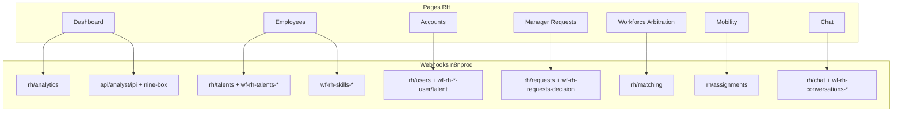

# Audit workspace RH — Strategic Copilot (frontend)

**Date :** 2026-06-11 (Sprint 1 frontend appliqué)  
**Périmètre :** rôle `rh` · routes `/workspace/rh/*` (+ `/workspace/rh/manager-requests` et `/workspace/rh/projects-budget` accessibles aussi au rôle `manager`)  
**Codebase :** `copilot-ui/src`  
**Backend :** webhooks n8n (`https://n8nprod.aphelionxinnovations.com`) — en dev, proxy Vite `/webhook` → n8n  
**Auth :** `Authorization: Bearer <JWT>` sur tous les appels (via `httpGet` / `httpPost` / `httpPatch` / `httpDelete` ou `fetch` dédiés)

## Sprint 1 — correctifs frontend (2026-06-11)

| # | Bug | Statut front | Backend n8n (parallèle) |
|---|-----|--------------|-------------------------|
| 1 | Routes legacy mortes → fausse complétude | ✅ 9 redirects supprimés · `RhNotFoundPage` · legacy `talent/:id` + `actions/:id` conservés | — |
| 2 | `console.log` Workforce Arbitration | ✅ supprimés | — |
| 3 | Fallback `rh_score = 65` | ✅ `null` + `ScoreHeroEmpty` | — |
| 4 | Demandes managers filtres/KPI client | ✅ params serveur + `GET /requests/summary` · fallback client `TODO BACKEND` | ⏳ `BACKEND_N8N_Sprint1_Changes.md` — summary + filtres SQL |

---

## 1. Vue d’ensemble

| Élément | Détail |
|---------|--------|
| **Layout** | `layouts/rh-workspace-layout.tsx` → `WorkspaceShellLayout` |
| **Navigation** | `layouts/nav/use-rh-workspace-nav.ts` (10 entrées sidebar) |
| **Protection** | `ProtectedRoute` rôle `rh` ; `manager-requests` accepte `manager` \| `rh` |
| **Stack data** | React Query + hooks dédiés + `fetch` / client HTTP central (`api/api.ts`) |
| **Topbar RH** | `RhNotificationsTopbarDropdown` — notifications WF_RH_Notifications |
| **Copilot page** | `useCopilotPage(...)` par page (contexte RH pour le panneau IA) |

### Routes actives (`main.tsx`)

| Route | Page | Menu latéral | Statut |
|-------|------|--------------|--------|
| `/workspace/rh` | Redirect → `dashboard` | — | Actif |
| `/workspace/rh/dashboard` | `RhDashboardPage` | Oui | Actif |
| `/workspace/rh/employees` | `RhEmployeesPage` | Oui | Actif |
| `/workspace/rh/accounts` | `RhAccountsPage` | Oui | Actif |
| `/workspace/rh/workforce-arbitration` | `RhWorkforceArbitrationPage` | Oui | Actif |
| `/workspace/rh/mobility` | `RhMobilityPage` | Oui | Actif |
| `/workspace/rh/chat` | `RhChatPage` | Oui | Actif |
| `/workspace/rh/profile` | `RhProfilePage` | Oui | Actif |
| `/workspace/rh/projects-budget` | `RhProjectsBudgetEntry` → `RhProjectsBudgetPage` | Oui | Actif |
| `/workspace/rh/manager-requests` | `RhManagerRequestsEntry` → `ManagerRequestsPage` | Oui | Actif |
| `/users` | Redirect → `/workspace/rh/employees` | — | Legacy |

### Redirects legacy (fonctionnels)

| Route | Redirection |
|-------|-------------|
| `copilot` | → `/workspace/rh/chat` |
| `/workspace/rh/talent/:talentId` | → `/workspace/rh/employees?talentId=:id` |
| `/workspace/rh/actions/:actionId` | → `/workspace/rh/manager-requests?action=:id` |

### Routes mortes (Sprint 1)

Les anciennes routes `skills-catalog`, `critical-gaps`, `training-plans`, `org-alerts`, `sessions`, `reports`, `projects`, `decision-log` ne redirigent plus vers le dashboard : elles renvoient **404** (`RhNotFoundPage` via `path="*"`).

### Sidebar (`use-rh-workspace-nav.ts`)

| Label UI | Clé i18n | Path |
|----------|----------|------|
| Dashboard RH | `nav:rhNavDashboard` | `/workspace/rh/dashboard` |
| Employés & talents | `nav:rhNavEmployees` | `/workspace/rh/employees` |
| Demandes managers | `nav:rhNavManagerRequests` | `/workspace/rh/manager-requests` |
| Gestion des comptes | `nav:rhNavAccounts` | `/workspace/rh/accounts` |
| Workforce Arbitration | `nav:rhNavWorkforceArbitration` | `/workspace/rh/workforce-arbitration` |
| Mobilité & réaffectation | `nav:rhNavMobility` | `/workspace/rh/mobility` |
| Assistant RH IA | *(hardcodé FR)* | `/workspace/rh/chat` |
| Profil | `nav:profile` | `/workspace/rh/profile` |

---

## 2. Infrastructure API commune

### Proxy Vite (dev)

| Préfixe client | Cible n8n |
|----------------|-----------|
| `/webhook/*` | `n8nprod.aphelionxinnovations.com/webhook/*` |
| `/rh/*` | `…/webhook/rh/*` (rewrite) |
| `/api/*` | `…/webhook/api/*` |

Fichier : `vite.config.ts` (racine monorepo).

### Client HTTP

| Fichier | Rôle |
|---------|------|
| `api/api.ts` | `httpGet`, `httpPost`, `httpPatch`, `httpDelete` — Bearer auto, refresh 401 |
| `lib/build-n8n-url.ts` | Base URL n8n / chemins relatifs `/webhook/...` |
| `config/backend-api.ts` | Chemins legacy `/rh/*` (utilisés par `rhService.ts`) |

### Variables d’environnement RH (principales)

| Variable | Usage |
|----------|--------|
| `VITE_RH_DASHBOARD_API_BASE` | Base analytics / notifications |
| `VITE_RH_EMPLOYMENT_GET_URL` / `PUT_URL` | Contrat emploi talent |
| `VITE_RH_ABSENCES_*` | CRUD absences |
| `VITE_API_RH_USERS_*` | Legacy comptes (`backend-api.ts`) |
| `VITE_API_RH_LIST_TALENTS_BASE` | Override liste talents modal comptes |
| `VITE_API_RH_CREATE_USER_V2_BASE` | Override création user v2 |
| `VITE_API_RH_USER_DELETE_BASE` | Override DELETE user |
| `VITE_API_RH_TALENT_PATCH_BASE` / `DELETE_BASE` | Override PATCH/DELETE talent comptes |

---

## 3. Cartographie API RH (fichiers sources)

| Fichier | Domaine |
|---------|---------|
| `api/rh-dashboard.api.ts` | Analytics + notifications |
| `api/rh-talents.api.ts` | CRUD talents (liste, détail, create, update, delete) |
| `api/rh-accounts.api.ts` | Gestion comptes manager/RH/talent |
| `api/rh-requests-decision.api.ts` | Demandes managers (liste, décision) |
| `api/rh-assignments.api.ts` | Mobilité / affectations manager↔talent |
| `api/rh-matching.api.ts` | Workforce arbitration (matching IA) |
| `api/rh-availability.api.ts` | Disponibilité talents |
| `api/rh-employment.api.ts` | Contrat / emploi |
| `api/rh-absences.api.ts` | Absences |
| `api/rh-talent-skills.api.ts` | Compétences par talent |
| `api/rh-skills.api.ts` | Catalogue compétences |
| `api/rh-analyst.api.ts` | IPI + Nine-Box (analyste IA) |
| `api/rh-managers.api.ts` | Liste managers (pickers) |
| `api/rh-actions.api.ts` | Actions manager→RH (transversal) |
| `api/rh-workspace.api.ts` | Agrégats legacy dashboard |
| `api/rhService.ts` | Legacy users/sessions (`backend-api.ts`) |
| `services/rh-chat/rh-chat.api.ts` | Assistant RH IA |

---

## 4. Audit page par page

### 4.1 Dashboard RH — `/workspace/rh/dashboard`

| | |
|---|---|
| **Page** | `pages/workspace/rh/rh-dashboard-page.tsx` |
| **Composant racine** | `components/rh/DashboardRH.tsx` |
| **Sous-sections** | `RhDashboardExecutiveOverview`, `RhDashboardActionCenter`, `RhTalentInsightsSection`, `RhDashboardWorkforceAnalytics`, `RhDashboardSkillsCapacity` |
| **Hook** | `useCopilotPage("rh_dashboard")` |

**API**

| Opération | Méthode | Endpoint n8n |
|-----------|---------|--------------|
| Analytics globaux | GET | `/webhook/rh/analytics` — **WF_RH_Analytics** |
| Insights IPI | POST | `/webhook/api/analyst/ipi` |
| Nine-Box | POST | `/webhook/api/analyst/nine-box` |
| Notifications (topbar) | GET | `/webhook/rh/notifications?limit&offset&only_unread` |
| Supprimer notification | DELETE | `/webhook/rh/notifications/:id` |
| Scan notifications | POST | `/webhook/rh/notifications/trigger` |

**Fichiers API :** `rh-dashboard.api.ts`, `rh-analyst.api.ts`  
**Actions utilisateur :** KPIs charge/compétences/projets ; onglets analyste ; navigation vers talents ; notifications topbar.

---

### 4.2 Employés & talents — `/workspace/rh/employees`

| | |
|---|---|
| **Page** | `pages/workspace/rh/rh-employees-page.tsx` |
| **Composant racine** | `components/rh/TalentsRH.tsx` |
| **Modales / drawer** | `CreateTalentModal`, `DeleteTalentModal`, `TalentDrawer` (overview, skills, employment, absences) |
| **Deep link** | `?talentId=` (depuis notifications) |
| **Hook** | `useCopilotPage("rh_employees")` |

**API**

| Opération | Méthode | Endpoint |
|-----------|---------|----------|
| Liste talents | GET | `/webhook/rh/talents?enterprise_id&status&limit&search` |
| Détail talent | GET | `/webhook/wf-rh-talents-detail-v1/rh/talents/:id` |
| Créer talent | POST | `/webhook/rh/talents` |
| Modifier talent | PATCH | `/webhook/wf-rh-talents-update-v1/rh/talents/:id` |
| Supprimer talent | DELETE | `/webhook/wf-rh-talents-delete-v1/rh/talents/:id` |
| Overview disponibilité | GET | `/webhook/rh/availability/overview` |
| Dispo talent | GET | `/webhook/rh/talents/:id/availability` |
| Emploi GET/PUT | GET/PUT | URLs env `VITE_RH_EMPLOYMENT_*` |
| Absences | GET/POST/DELETE | URLs env `VITE_RH_ABSENCES_*` |
| Skills talent | GET/POST/PATCH/DELETE | `/webhook/wf-rh-skills-{get\|add\|update\|delete}-v1/rh/talents/:id/skills` |
| Catalogue skills | GET | `/webhook/rh/skills/catalog` |
| Liste managers | GET | `/webhook/rh/managers` |

**Hooks :** `useRhAvailabilityOverview`, `useUpdateRhTalentMutation`, `useTalentEmployment`, `useTalentAbsences`, `useTalentAvailability`, `use-rh-talent-skills`  
**Actions :** filtres ; CRUD talent ; drawer multi-onglets ; gestion compétences / contrat / absences.

---

### 4.3 Gestion des comptes — `/workspace/rh/accounts`

| | |
|---|---|
| **Page** | `pages/workspace/rh/rh-accounts-page.tsx` |
| **Composant racine** | `components/rh/accounts/RhAccountsManagement.tsx` |
| **Onglets** | Managers/RH · Talents · Comptes supprimés |
| **Modales** | `CreateStaffAccountModal`, `CreateTalentAccountModal`, `ChangePasswordModal`, `DeleteAccountConfirmModal` |
| **Hook** | `useRhAccounts` (`hooks/use-rh-accounts.ts`) |

**API — fichier `rh-accounts.api.ts`**

| Opération | Méthode | Endpoint production |
|-----------|---------|---------------------|
| Liste managers/RH | GET | `/webhook/rh/users?status=active&limit&offset` |
| Liste comptes talent | GET | `/webhook/rh/accounts/talent?status=active` |
| Comptes supprimés staff | GET | `/webhook/rh/users?status=disabled` |
| Comptes supprimés talent | GET | `/webhook/rh/accounts/talent?status=deleted` |
| Créer manager/RH | POST | `/webhook/rh/users` — body `{ full_name, email, password, role }` |
| Créer compte talent | POST | `/webhook/rh/accounts/talent` — body `{ name, email, job_title, … }` |
| Liste talents (modal « existant ») | GET | `/webhook/wf-rh-list-talents-v1/rh/accounts/talent` (+ repli `/webhook/rh/accounts/talent`) |
| Créer user depuis talent | POST | `/webhook/wf-rh-create-user-v2/rh/users` — body `{ full_name, email, password, role: "manager" }` |
| Changer mot de passe | PATCH | `/webhook/wf-rh-patch-user-v1/rh/users/:id` — `{ action: "change_password", new_password }` |
| Toggle statut staff | PATCH | `/webhook/wf-rh-patch-user-v1/rh/users/:id` — `{ action: "toggle_status" }` |
| Toggle statut talent | PATCH | `/webhook/wf-rh-patch-talent-v1/rh/accounts/talent/:id` — `{ action: "toggle_status" }` |
| Supprimer manager/RH | DELETE | `/webhook/wf-rh-delete-user-v1/rh/users/:id` |
| Supprimer talent | DELETE | `/webhook/wf-rh-delete-talent-v1/rh/accounts/talent/:id` |

**Actions :** CRUD comptes ; toggle actif/inactif ; changement MDP (staff uniquement) ; création compte depuis talent existant (onglet modal).

---

### 4.4 Demandes managers — `/workspace/rh/manager-requests`

| | |
|---|---|
| **Page** | `pages/rh/ManagerRequestsPage.tsx` (entrée `RhManagerRequestsEntry`) |
| **Hooks** | `useRhRequestsListQuery`, `useRhRequestsDecision` |
| **Workflow** | **WF_RH_Requests_Decision** |

**API — `rh-requests-decision.api.ts`**

| Opération | Méthode | Endpoint |
|-----------|---------|----------|
| Liste demandes | GET | `/webhook/rh/requests?status&type&priority&project_id` |
| Détail | GET | `/webhook/rh/requests/:id` |
| Décision (accept/reject/progress/done) | PATCH | `/webhook/wf-rh-requests-decision-v1/rh/requests/:id` |
| Historique actions | GET | `/webhook/rh/requests/:id/actions` |

**Actions :** KPI par statut ; filtres ; drawer détail ; décisions RH ; deep link `?action=:id`.

> Distinct de **WF_Manager_RH_Actions** (`/webhook/api/rh/actions`) — soumission côté manager.

---

### 4.5 Workforce Arbitration — `/workspace/rh/workforce-arbitration`

| | |
|---|---|
| **Page** | `pages/workspace/rh/rh-workforce-arbitration-page.tsx` |
| **Composant** | `WorkforceArbitrationView` |
| **Hooks** | `useRhMatchingProjects`, `useRhMatchingResults`, `useRunRhWorkforceMatching` |
| **Hook copilot** | `useCopilotPage("rh_workforce_arbitration")` |

**API — `rh-matching.api.ts`**

| Opération | Méthode | Endpoint |
|-----------|---------|----------|
| Projets éligibles | GET | `/webhook/rh/matching/projects` |
| Lancer matching IA | POST | `/webhook/rh/matching` — body `{ project_id, top_n, min_availability_pct }` |
| Résultats sauvegardés | GET | `/webhook/rh/matching/results?project_id=` |

**Actions :** sélection projet ; lancer matching ; afficher classement talents / scores.

---

### 4.6 Mobilité & réaffectation — `/workspace/rh/mobility`

| | |
|---|---|
| **Page** | `pages/workspace/rh/rh-mobility-page.tsx` |
| **Composant racine** | `components/rh/mobility/RhMobilityStaffing.tsx` |
| **Sous-composants** | `StaffingKpiStrip`, `StaffingToolbar`, `StaffingAllocationBoard`, `AssignmentFormDrawer`, `DeleteAssignmentModal` |
| **Workflow** | **WF_RH_Assignments** |

**API — `rh-assignments.api.ts`**

| Opération | Méthode | Endpoint |
|-----------|---------|----------|
| Liste affectations | GET | `/webhook/rh/assignments?status&limit` |
| Créer affectation | POST | `/webhook/rh/assignments` |
| Supprimer affectation | DELETE | `/webhook/wf-rh-assignments-delete-v2/rh/assignments/:talent_id` |
| Liste talents (picker) | GET | `/webhook/rh/talents` |

**Actions :** filtres manager ; CRUD affectation talent→manager ; KPI staffing.

---

### 4.7 Assistant RH IA — `/workspace/rh/chat`

| | |
|---|---|
| **Page** | `pages/workspace/rh/rh-chat-page.tsx` |
| **Composants** | `RhChatSidebar`, `RhChatMainPanel`, `RhChatAnalysisPanel`, `RhChatWelcomeScreen` |
| **Hooks** | `useRhChatConversationsQuery`, `useRhChatConversationDetailQuery`, `useRhChatSendMutation`, `useRhChatArchiveMutation` |

**API — `services/rh-chat/rh-chat.api.ts`**

| Opération | Méthode | Endpoint |
|-----------|---------|----------|
| Liste conversations | GET | `/webhook/rh/conversations` |
| Détail + messages | GET | `/webhook/wf-rh-conversations-detail-v1/rh/conversations/:id` |
| Archiver / restaurer | PATCH | `/webhook/wf-rh-conversations-archive-v1/rh/conversations/:id/archive` |
| Envoyer message | POST | `/webhook/rh/chat` |

**Actions :** nouvelle conversation ; filtre actif/archivé ; envoi message ; panneau analyse (confiance, sources).

---

### 4.8 Profil — `/workspace/rh/profile`

| | |
|---|---|
| **Page** | `RhProfilePage` |
| **Statut** | Actif — GET/PATCH `/webhook/rh/profile` |
| **API** | `rh-profile.api.ts` |

### 4.9 Budget RH — `/workspace/rh/projects-budget`

| | |
|---|---|
| **Page** | `RhProjectsBudgetPage` |
| **Workflow** | `WF_RH_Project_Budget_v1` |
| **API** | `rh-budget.api.ts` — strict backend |

---

## 5. Référence complète des endpoints n8n (workflows nommés)

| Slug workflow | Méthodes | Chemin relatif |
|---------------|----------|----------------|
| WF_RH_Analytics | GET | `/webhook/rh/analytics` |
| WF_RH_Talents | GET, POST | `/webhook/rh/talents` |
| wf-rh-talents-detail-v1 | GET | `/webhook/wf-rh-talents-detail-v1/rh/talents/:id` |
| wf-rh-talents-update-v1 | PATCH | `/webhook/wf-rh-talents-update-v1/rh/talents/:id` |
| wf-rh-talents-delete-v1 | DELETE | `/webhook/wf-rh-talents-delete-v1/rh/talents/:id` |
| wf-rh-skills-*-v1 | GET/POST/PATCH/DELETE | `/webhook/wf-rh-skills-*/rh/talents/:id/skills` |
| WF_RH_Assignments | GET, POST | `/webhook/rh/assignments` |
| wf-rh-assignments-delete-v2 | DELETE | `/webhook/wf-rh-assignments-delete-v2/rh/assignments/:talent_id` |
| WF_RH_Matching | GET, POST | `/webhook/rh/matching`, `/webhook/rh/matching/projects`, `/webhook/rh/matching/results` |
| WF_RH_Requests | GET | `/webhook/rh/requests`, `/webhook/rh/requests/:id` |
| wf-rh-requests-decision-v1 | PATCH | `/webhook/wf-rh-requests-decision-v1/rh/requests/:id` |
| wf-rh-patch-user-v1 | PATCH | `/webhook/wf-rh-patch-user-v1/rh/users/:id` |
| wf-rh-patch-talent-v1 | PATCH | `/webhook/wf-rh-patch-talent-v1/rh/accounts/talent/:id` |
| wf-rh-delete-user-v1 | DELETE | `/webhook/wf-rh-delete-user-v1/rh/users/:id` |
| wf-rh-delete-talent-v1 | DELETE | `/webhook/wf-rh-delete-talent-v1/rh/accounts/talent/:id` |
| wf-rh-create-user-v2 | POST | `/webhook/wf-rh-create-user-v2/rh/users` |
| wf-rh-list-talents-v1 | GET | `/webhook/wf-rh-list-talents-v1/rh/accounts/talent` |
| Comptes (générique) | GET/POST | `/webhook/rh/users`, `/webhook/rh/accounts/talent` |
| WF_RH_Chat | POST | `/webhook/rh/chat` |
| WF_RH_Conversations | GET, PATCH | `/webhook/rh/conversations`, `wf-rh-conversations-*` |
| WF Analyst | POST | `/webhook/api/analyst/ipi`, `/webhook/api/analyst/nine-box` |

---

## 6. Hooks RH

| Hook | Fichier | Page / usage |
|------|---------|--------------|
| `useRhWorkspaceNavItems` | `layouts/nav/use-rh-workspace-nav.ts` | Sidebar |
| `useRhAnalyticsQuery` | `use-rh-workspace-queries.ts` | Dashboard |
| `useRhNotificationsQuery` | idem | Dashboard / topbar |
| `useRhNotificationsTopbar` | `use-rh-notifications.ts` | Cloche topbar |
| `useRhTalents` / `useUpdateRhTalentMutation` | `use-rh-talents.ts` | Employés |
| `useRhTalentSkillsQuery` + mutations | `use-rh-talent-skills.ts` | Drawer skills |
| `useRhAvailabilityOverview` | `useRhAvailabilityOverview.ts` | Liste talents |
| `useTalentAvailability` | `useTalentAvailability.ts` | Drawer dispo |
| `useTalentEmployment` | `use-rh-talent-employment.ts` | Drawer emploi |
| `useTalentAbsences` | `useTalentAbsences.ts` | Drawer absences |
| `useRhAccounts` | `use-rh-accounts.ts` | Gestion comptes |
| `useRhRequestsListQuery` / `useRhRequestsDecision` | `use-rh-requests-decision.ts` | Demandes managers |
| `useRhMatchingProjects` / `useRunRhWorkforceMatching` | `useRhWorkforceMatching.ts` | Workforce arbitration |
| `useRhChat*Mutation/Query` | `hooks/rh-chat/*` | Chat RH |
| `useRhSessions` | `use-rh-sessions.ts` | Legacy sessions |

---

## 7. Types TypeScript RH

| Fichier | Contenu principal |
|---------|-------------------|
| `types/rh-dashboard.types.ts` | Analytics, notifications, KPIs |
| `types/rh-talents.types.ts` | Liste, détail, payloads CRUD talent |
| `types/rh-accounts.types.ts` | Comptes staff/talent, actions PATCH, onglets |
| `types/rh-assignments.types.ts` | Affectations mobilité |
| `types/rh-matching.types.ts` | Matching IA, top matches |
| `types/rh-availability.types.ts` | Disponibilité overview + détail |
| `types/rh-employment.types.ts` | Contrat emploi |
| `types/rh-absences.types.ts` | Absences |
| `types/rh-talent-skills.types.ts` | Compétences talent |
| `types/rh-analyst.types.ts` | IPI, Nine-Box |
| `types/rh-chat.ts` | Conversations, messages, analyse |

---

## 8. Legacy / doublons à connaître

| Zone | Détail |
|------|--------|
| **Comptes** | Page `/accounts` → `rh-accounts.api.ts` (workflows `wf-rh-*`). Ancienne page users → `rhService.ts` + `backend-api.ts` (`/rh/users`, password-reset) — **non utilisée par la page comptes actuelle**. |
| **Profil RH** | Placeholder — pas de branchement API. |
| **Routes legacy** | Redirigent vers dashboard / employees / manager-requests. |
| **Employment & absences** | URLs 100 % pilotées par variables d’env — vérifier `.env` / `.env.example` pour prod. |
| **Assistant RH IA** | Label sidebar non i18n (hardcodé « Assistant RH IA »). |
| **Manager requests** | Les managers sont redirigés vers `/workspace/manager/hr-requests` via `RhManagerRequestsEntry`. |

---

## 9. Schéma de flux (pages → n8n)

---

## 10. Checklist validation manuelle (QA)

- [ ] JWT valide sur chaque appel (Network → header `Authorization`)
- [ ] Dev : URLs commencent par `/webhook/...` (pas d’appel direct n8n sans proxy sauf config explicite)
- [ ] Dashboard : GET analytics 200 + KPIs affichés
- [ ] Employés : liste, drawer, CRUD talent, skills, emploi, absences
- [ ] Comptes : listes, création, PATCH toggle/mdp, DELETE soft delete
- [ ] Demandes managers : décision PATCH + historique
- [ ] Workforce : POST matching + GET résultats
- [ ] Mobilité : CRUD affectations
- [ ] Chat : conversations + envoi message
- [ ] Erreurs n8n : toast avec `message` JSON (pas de HTML brut)

---

*Document généré depuis l’audit statique du code `copilot-ui/src`. Pour valider les workflows n8n en runtime, tester chaque endpoint avec un token RH valide sur n8nprod ou via le proxy Vite local.*
